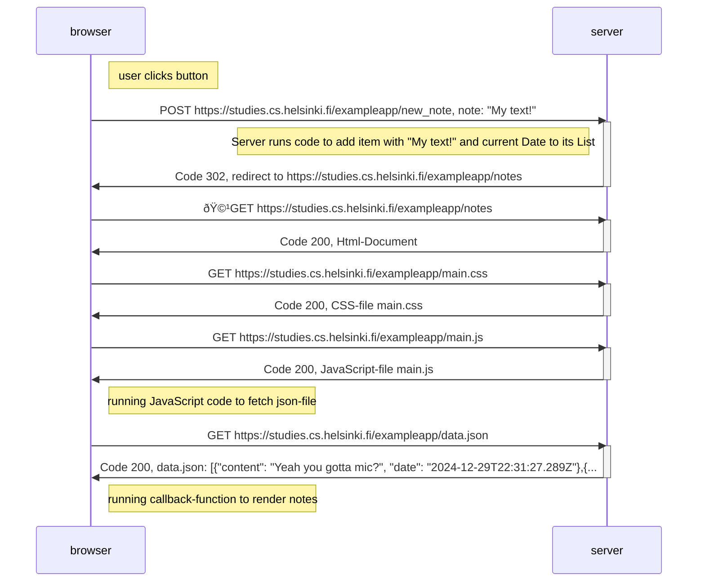

```mermaid
sequenceDiagram
participant browser
participant server

Note right of browser: user clicks button
browser->>server: POST https://studies.cs.helsinki.fi/exampleapp/new_note, note: "My text!"
activate server
Note left of server: Server runs code to add item with "My text!" and current Date to its List
server->>browser: Code 302, redirect to https://studies.cs.helsinki.fi/exampleapp/notes
deactivate server
browser->>server:🩹GET https://studies.cs.helsinki.fi/exampleapp/notes
activate server
server->>browser: Code 200, Html-Document
deactivate server
browser->>server: GET https://studies.cs.helsinki.fi/exampleapp/main.css
activate server
server->>browser: Code 200, CSS-file main.css
deactivate server
browser->>server: GET https://studies.cs.helsinki.fi/exampleapp/main.js
activate server
server->>browser: Code 200, JavaScript-file main.js
deactivate server
Note right of browser: running JavaScript code to fetch json-file
browser->>server: GET https://studies.cs.helsinki.fi/exampleapp/data.json
activate server
server->>browser: Code 200, data.json: [{"content": "Yeah you gotta mic?", "date": "2024-12-29T22:31:27.289Z"},{...
deactivate server
Note right of browser: running callback-function to render notes
```
