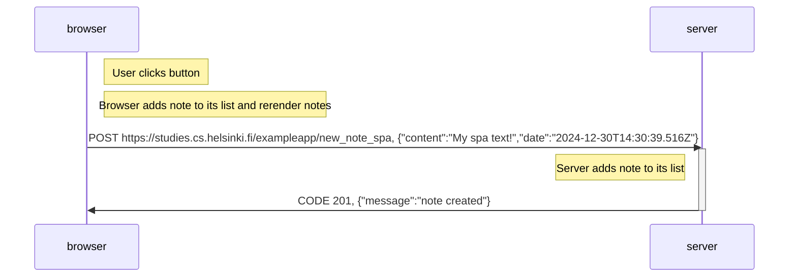

```mermaid
sequenceDiagram
participant browser
participant server

Note right of browser: User clicks button
Note right of browser: Browser adds note to its list and rerender notes
browser->>server: POST https://studies.cs.helsinki.fi/exampleapp/new_note_spa, {"content":"My spa text!","date":"2024-12-30T14:30:39.516Z"}
activate server
Note left of server: Server adds note to its list
server->>browser: CODE 201, {"message":"note created"}
deactivate server
```
