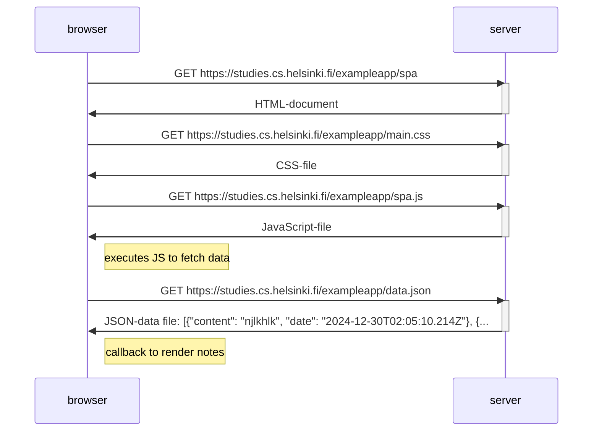

```mermaid
sequenceDiagram
participant browser
participant server

browser->>server: GET https://studies.cs.helsinki.fi/exampleapp/spa
activate server
server->>browser: HTML-document
deactivate server
browser->>server: GET https://studies.cs.helsinki.fi/exampleapp/main.css
activate server
server->>browser: CSS-file
deactivate server
browser->>server: GET https://studies.cs.helsinki.fi/exampleapp/spa.js
activate server
server->>browser: JavaScript-file
deactivate server
Note right of browser: executes JS to fetch data
browser->>server: GET https://studies.cs.helsinki.fi/exampleapp/data.json
activate server
server->>browser: JSON-data file: [{"content": "njlkhlk", "date": "2024-12-30T02:05:10.214Z"}, {...
deactivate server
Note right of browser: callback to render notes
```
